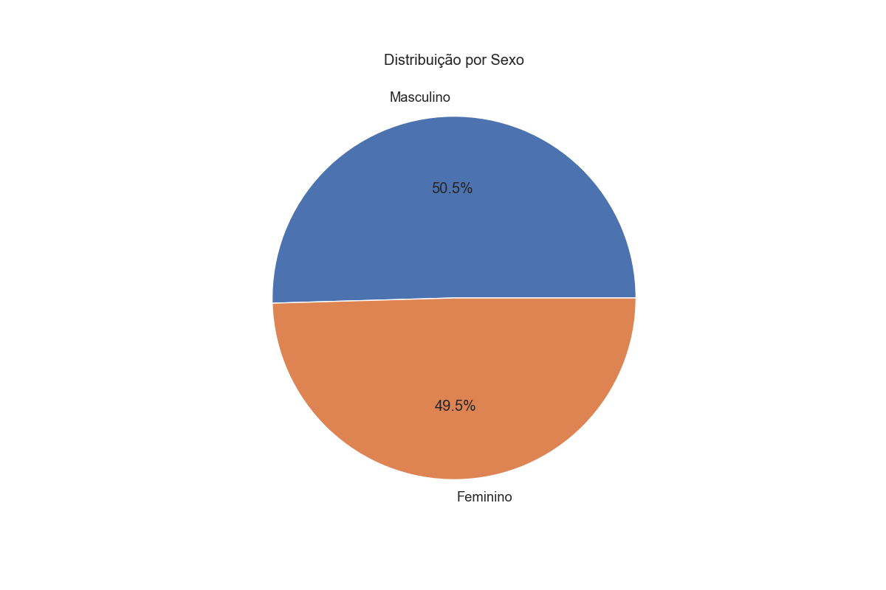
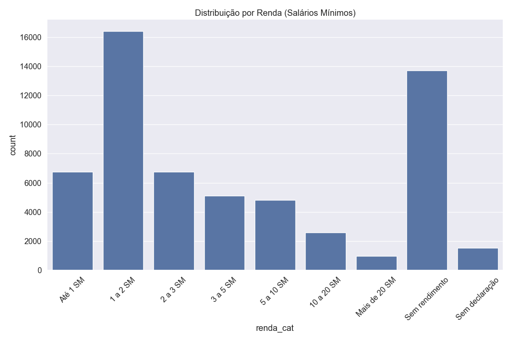
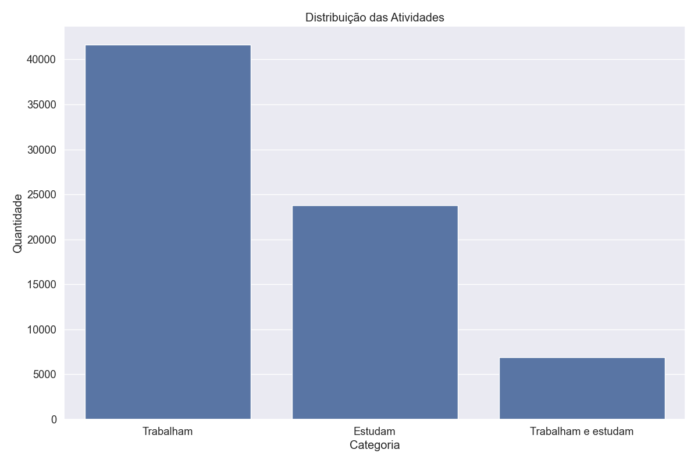
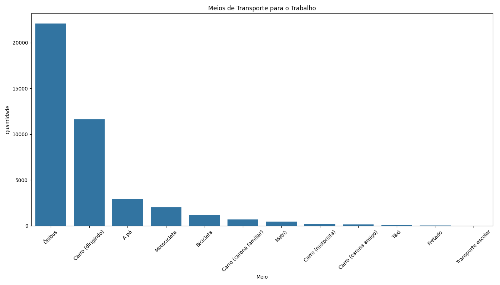
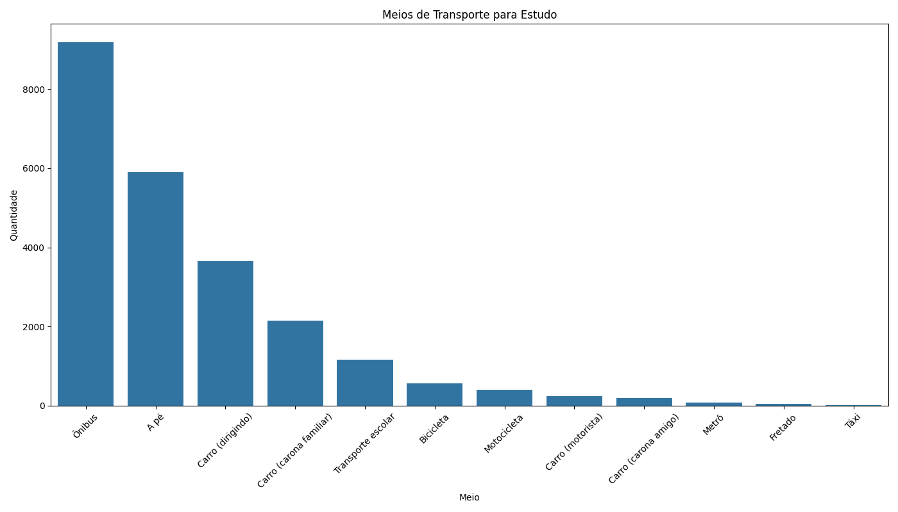

# 🚌 Análise de Mobilidade Urbana - Recife 2016

[](https://python.org)
[](https://pandas.pydata.org/)
[](https://matplotlib.org/)
[](https://seaborn.pydata.org/)

## 📋 Sobre o Projeto

Este projeto realiza uma análise completa dos padrões de **mobilidade urbana** na Região Metropolitana do Recife utilizando dados oficiais da **Pesquisa Origem-Destino de 2016**. 

O objetivo é extrair insights sobre comportamentos de transporte, características demográficas e identificar oportunidades para políticas públicas de mobilidade urbana.

### 🎯 Objetivos
- **Analisar** padrões de mobilidade urbana em uma grande metrópole brasileira
- **Identificar** perfis de usuários de diferentes modais de transporte  
- **Investigar** correlações entre variáveis socioeconômicas e escolha de transporte
- **Avaliar** o uso de tecnologia (aplicativos) no contexto da mobilidade
- **Gerar** insights para melhoria da infraestrutura de transporte

## 📊 Dataset

| Característica | Valor |
|----------------|--------|
| **Fonte** | Pesquisa Origem-Destino Recife 2016 - Dados Oficiais |
| **Total de Registros** | 58.644 registros completos |
| **Variáveis** | 49 campos (demográficos, socioeconômicos, mobilidade) |
| **Período** | 2016 |
| **Abrangência** | Região Metropolitana do Recife |

## 🔍 Principais Descobertas

### 📈 **Demografia da População**
- **Distribuição por Sexo**: Equilibrada (50.5% masculino, 49.5% feminino)
- **Faixa Etária Predominante**: 25-39 anos (população economicamente ativa)
- **Perfil de Renda**: Concentração em baixa/média renda (1-2 salários mínimos)
- **Mobilidade Reduzida**: Baixa incidência na amostra

### 🚆 **Padrões de Mobilidade**
- **População Economicamente Ativa**: ~42.000 pessoas trabalham
- **População Estudantil**: ~24.000 pessoas estudam  
- **Dupla Jornada**: ~6.700 pessoas trabalham e estudam
- **Principal Modal**: Transporte público (ônibus) dominante

### 📱 **Adoção Tecnológica**
- **Internet Móvel**: Alta penetração de celulares com internet
- **Aplicativos de Transporte**: Uso ainda limitado para táxi
- **Terminais de Integração**: Utilizados por usuários do sistema de ônibus

## 🛠️ Tecnologias Utilizadas

```python
# Principais bibliotecas
import pandas as pd           # Manipulação de dados
import matplotlib.pyplot as plt  # Visualizações básicas  
import seaborn as sns        # Visualizações estatísticas
import numpy as np           # Computação numérica
```

## 🚀 Como Executar o Projeto

### Pré-requisitos
```bash
# Python 3.8 ou superior
# Bibliotecas necessárias
pip install pandas matplotlib seaborn numpy
```

### Execução
```bash
# 1. Clone o repositório
git clone https://github.com/JoseSantosJ/analise-mobilidade-recife.git
cd analise-mobilidade-recife

# 2. Certifique-se de que o arquivo CSV está no diretório
# pesquisaodrecife2016.csv

# 3. Execute a análise
python analise_od_recife.py
```

### Saídas Geradas
O script gera automaticamente os seguintes arquivos:
- `distribuicao_sexo.png` - Gráfico de pizza da distribuição por sexo
- `distribuicao_faixa_etaria.png` - Distribuição por faixa etária
- `distribuicao_renda.png` - Distribuição por faixa de renda
- `mobilidade_reduzida.png` - Análise de mobilidade reduzida
- `distribuicao_atividades.png` - Pessoas que trabalham/estudam
- `transportes_trabalho.png` - Meios de transporte para trabalho
- `transportes_estudo.png` - Meios de transporte para estudo

## 📁 Estrutura do Projeto

```
📦 analise-mobilidade-recife/
├── analise_od_recife.py              # Script principal de análise
├── pesquisaodrecife2016.csv          # Dataset original (não versionado)
├── README.md                         # Este arquivo
├── requirements.txt                  # Dependências do projeto
├── *.png                            # Gráficos gerados pela análise
└── LICENSE                          # Licença MIT
```

## 📈 Resultados e Visualizações

### 1. Distribuição por Sexo


A análise revela distribuição equilibrada entre os gêneros: 50.5% masculino e 49.5% feminino, indicando representatividade adequada da amostra.

### 2. Distribuição por Faixa Etária  


Concentração significativa na faixa de 25-39 anos (população economicamente ativa), seguida pela faixa de 40-59 anos, refletindo o perfil da força de trabalho metropolitana.

### 3. Distribuição por Renda


Predominância nas faixas de 1-2 salários mínimos, com concentração de baixa/média renda. Destaque para o grupo "sem rendimento", indicando desafios socioeconômicos.

### 4. Mobilidade Reduzida


Baixa incidência de pessoas com mobilidade reduzida na amostra, sugerindo que a pesquisa capturou principalmente população com plena capacidade de locomoção.

### 5. Distribuição das Atividades


Análise mostra que aproximadamente 42.000 pessoas trabalham, 24.000 estudam, e cerca de 6.700 combinam trabalho e estudo, evidenciando a dinâmica da população metropolitana.

### 6. Meios de Transporte para Trabalho


O gráfico evidencia a predominância do transporte público, com o ônibus como modal principal para deslocamentos ao trabalho.

### 7. Meios de Transporte para Estudo


Padrão similar ao trabalho, com forte dependência do sistema público de transporte para acesso às instituições de ensino.

## 🧹 Metodologia de Análise

### 1. **Importação e Preparação**
```python
# Leitura com tratamento adequado de encoding
df = pd.read_csv('pesquisaodrecife2016.csv', sep=';', encoding='utf-8', low_memory=False)
```

### 2. **Limpeza e Transformação**
- **Conversão de Códigos**: Valores numéricos → categorias descritivas
- **Tratamento de Nulos**: Padronização de valores faltantes
- **Criação de Variáveis**: Campos categóricos derivados dos dados originais

### 3. **Análise Exploratória**
- **Demografia**: Distribuições de sexo, idade, renda
- **Mobilidade**: Análise de atividades (trabalho/estudo)
- **Transporte**: Identificação de modais utilizados
- **Tecnologia**: Avaliação do uso de aplicativos e terminais

### 4. **Visualização**
- **Gráficos de Pizza**: Para variáveis categóricas binárias
- **Gráficos de Barras**: Para distribuições de frequência
- **Análise Comparativa**: Entre diferentes grupos demográficos

## 💡 Insights para Políticas Públicas

### 🎯 **Recomendações Estratégicas**

**1. Fortalecimento do Transporte Público**
- Sistema de ônibus é o modal predominante
- Oportunidade de melhorar qualidade e integração

**2. Inclusão Digital no Transporte**
- Alta penetração de smartphones
- Potencial para soluções digitais integradas

**3. Infraestrutura para Mobilidade Ativa**  
- Parcela significativa se desloca a pé
- Necessidade de calçadas e ciclovias seguras

**4. Foco na População Economicamente Ativa**
- Maioria trabalha e/ou estuda
- Demanda por transporte eficiente nos horários de pico

## 🔧 Funcionalidades do Código

### Funções Principais
- `carregar_dados()` - Importação segura do CSV
- `preparar_dados()` - Limpeza e conversão de categorias
- `analisar_demografia()` - Análise do perfil populacional
- `analisar_mobilidade()` - Estudo de padrões de atividade
- `analisar_transportes()` - Análise de modais de transporte
- `analisar_tecnologia()` - Avaliação do uso de tecnologia

### Características Técnicas
- **Tratamento de Encoding**: UTF-8 com separador personalizado
- **Mapeamento de Valores**: Conversão automática de códigos para texto
- **Geração de Gráficos**: Visualizações automáticas e salvas
- **Análise Robusta**: Tratamento de valores múltiplos e nulos

## 📊 Estatísticas do Projeto

| Métrica | Valor |
|---------|--------|
| **Linhas de Código** | ~400 |
| **Funções Criadas** | 6 principais |
| **Gráficos Gerados** | 7 visualizações |
| **Categorias Analisadas** | Demografia, Mobilidade, Transporte, Tecnologia |
| **Tempo de Execução** | ~30 segundos |

## 🔮 Extensões Futuras

O projeto serve como base para análises mais avançadas:

- **Análise Geoespacial**: Mapeamento por zonas de tráfego
- **Análise Temporal**: Padrões por horário e frequência  
- **Machine Learning**: Modelos preditivos de escolha modal
- **Dashboard Interativo**: Interface web para exploração dos dados

## 🤝 Sobre o Desenvolvimento

Este projeto foi desenvolvido como parte de um portfólio de análise de dados, demonstrando competências em:

- **Manipulação de Dados**: Processamento de datasets complexos com Pandas
- **Análise Exploratória**: Identificação de padrões e insights em dados reais  
- **Visualização**: Criação de gráficos informativos e profissionais
- **Documentação**: Metodologia clara e reprodutível

O código está otimizado para ser executado de forma independente, gerando automaticamente todas as visualizações e análises apresentadas.

## 📄 Licença

Este projeto está sob a licença MIT. Veja [LICENSE](LICENSE) para detalhes.

## 👨‍💻 Autor

**José Antonio Santos Oliveira Junior**

[](https://linkedin.com/in/jose-santos-030b45259/)
[](https://github.com/JoseSantosJ)
[](mailto:josantos1200@hotmail.com)

## 🙏 Agradecimentos

- **Prefeitura do Recife** pelos dados da Pesquisa Origem-Destino
- **Comunidade Python** pelas excelentes bibliotecas de análise de dados
- **Seaborn e Matplotlib** por facilitarem a criação de visualizações

---

⭐ **Projeto desenvolvido para demonstrar competências em análise de dados e Python** ⭐